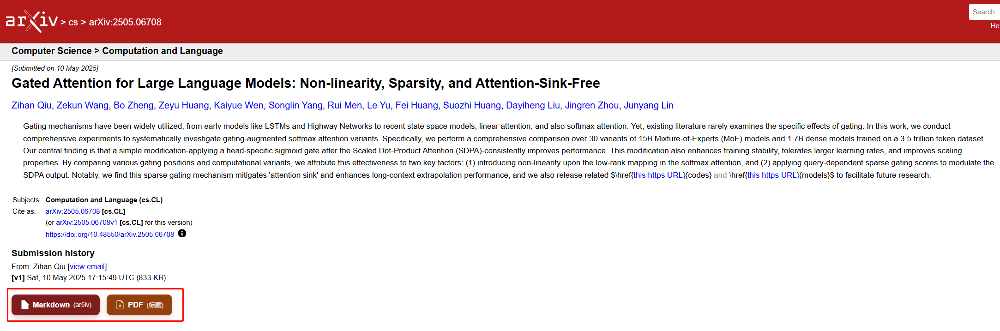
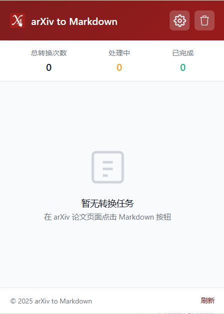

<p align="center">
  
</p>

<h1 align="center">arXiv to Markdown</h1>

<p align="center">
  Save arXiv papers as clean Markdown or well-named PDFs, directly from the paper page.
</p>

<p align="center">
  For people who read and organize papers in Obsidian, Notion, VS Code, or plain folders.
</p>

<p align="center">
  <a href="https://chromewebstore.google.com/detail/arxiv-to-markdown/pphdggfbjddgdljndgdablkhbdpbfnbd"></a>
  <a href="./README_CN.md"></a>
  <a href="./docs/FAQ.md"></a>
  <a href="./CHANGELOG.md"></a>
  <a href="./CONTRIBUTING.md"></a>
</p>

<p align="center">
  <a href="https://opensource.org/licenses/MIT"></a>
  
  
  <a href="https://github.com/Tendo33/arxiv-md/releases"></a>
</p>

<p align="center">
  <a href="#overview">Overview</a> |
  <a href="#screenshots">Screenshots</a> |
  <a href="#why-use-it">Why use it</a> |
  <a href="#features">Features</a> |
  <a href="#how-it-works">How it works</a> |
  <a href="#quick-start">Quick start</a> |
  <a href="#usage">Usage</a> |
  <a href="#settings">Settings</a> |
  <a href="#faq">FAQ</a> |
  <a href="#development">Development</a>
</p>

---

## Overview

`arXiv to Markdown` is a Chrome extension that adds save buttons to arXiv paper pages.

Instead of downloading another file named `2312.12345.pdf`, you can save a paper as:

- a Markdown file with a readable filename
- a PDF with cleaned-up naming
- a fallback result even when the preferred conversion path is unavailable

The extension is built around a simple idea: papers are easier to search, quote, annotate, and reuse when they are not trapped inside unnamed PDFs.

## Screenshots

You said you want room for screenshots later, so the README now includes dedicated slots.

### Main paper page



### Popup / task center



## Why use it

If you regularly read papers, the problem is familiar:

- PDFs pile up with filenames that mean nothing at a glance
- copying content into notes is slow and messy
- formulas and tables often get mangled during manual conversion
- new papers are easy to download, but hard to reuse later

This extension keeps the workflow short. Open a paper, click once, and save something you can actually work with.

## Features

### Made for real reading workflows

- Save papers as Markdown for Obsidian, Notion imports, VS Code, or local note systems
- Save PDFs with cleaner filenames when Markdown is not what you need
- Keep metadata with the exported file when enabled in settings

### Fast by default

- Uses [ar5iv](https://ar5iv.org) when available for quick HTML-to-Markdown conversion
- Runs the Markdown conversion locally in the browser
- Usually finishes much faster than copy-paste or manual cleanup

### Reliable fallback strategy

- `Tier 1`: ar5iv for speed and editable formulas
- `Tier 2`: MinerU for more difficult layouts and PDF parsing
- `Tier 3`: direct PDF download with a readable filename

### Better for paper organization

- Keeps LaTeX-style formulas in Markdown
- Preserves structure better than plain-text extraction
- Works well with note inbox folders and literature review workflows

### Built-in task handling

- Track conversion progress from the popup
- Review completed and failed tasks
- Retry failed MinerU jobs without starting from scratch

## How it works

The extension does not rely on a single conversion path.

1. On an arXiv paper page, it checks what conversion route is available.
2. If ar5iv has an HTML version, the extension converts that HTML to Markdown locally.
3. If you choose MinerU mode, or if you need a better PDF parser for a harder layout, it can submit the PDF to MinerU.
4. If Markdown conversion is not available, the extension can still save the original PDF with a cleaner filename.

That fallback chain is the main reason the tool feels dependable in everyday use.

## Quick start

### Option 1: install from Chrome Web Store

[Install arXiv to Markdown](https://chromewebstore.google.com/detail/arxiv-to-markdown/pphdggfbjddgdljndgdablkhbdpbfnbd)

### Option 2: install locally for development

```bash
git clone https://github.com/Tendo33/arxiv-md.git
cd arxiv-md
npm install
npm run build
```

Then:

1. Open `chrome://extensions/`
2. Turn on `Developer mode`
3. Click `Load unpacked`
4. Select the `dist` folder

## Usage

1. Open any arXiv paper page, for example [1706.03762](https://arxiv.org/abs/1706.03762).
2. Find the injected action buttons on the paper page.
3. Click `Markdown` to save a Markdown version, or `PDF` to save the paper as PDF.
4. Open the popup if you want to check task status, retry, or download completed results.

If you use Obsidian, setting Chrome's download folder to your vault inbox is usually enough to make the workflow feel seamless.

## Settings

The settings page keeps things simple.

### Conversion mode

- `Standard Mode`: uses ar5iv first and falls back when needed
- `MinerU Mode`: routes conversion through MinerU and requires a token

### Optional controls

- include metadata in Markdown output
- enable desktop notifications
- enable auto-convert prompts on paper pages
- manage MinerU token and connection testing

## FAQ

### Does it only work on arXiv?

Yes. The current version is built for `arxiv.org` paper pages.

### Is everything local?

The ar5iv-based Markdown conversion runs locally in your browser. MinerU mode is different because it depends on an external parsing service.

### Why does the Markdown button sometimes not appear?

Because ar5iv may not have processed that paper yet, especially for newer papers. In that case, PDF fallback is still useful.

### Does it work with formulas and tables?

That is one of the main reasons this extension exists. ar5iv-based conversion keeps formulas much better than quick copy-paste workflows, and MinerU can help with more difficult layouts.

### Where can I find more troubleshooting details?

See [FAQ](./docs/FAQ.md) and [PRIVACY.md](./PRIVACY.md).

## Development

### Scripts

- `npm run dev` starts webpack in watch mode
- `npm run build` creates a production build
- `npm run lint` runs ESLint
- `npm test` runs Jest
- `npm run package` builds and creates the release zip

### Project structure

```text
src/
|-- background/   # service worker
|-- content/      # content script injected into arXiv pages
|-- core/         # conversion and task logic
|-- ui/           # popup and settings pages
|-- utils/        # helpers, logging, storage
`-- config/       # constants and locales
```

### Release

Tagging a release as `vX.Y.Z` triggers the GitHub release workflow and packages the extension zip into `build/`.

## Contributing

Issues and pull requests are welcome.

- Contribution guide: [CONTRIBUTING.md](./CONTRIBUTING.md)
- Changelog: [CHANGELOG.md](./CHANGELOG.md)
- Issue tracker: [GitHub Issues](https://github.com/Tendo33/arxiv-md/issues)

## License

MIT. Maintained by [SimonSun](https://github.com/Tendo33).
